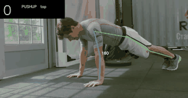
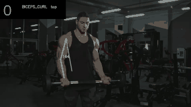
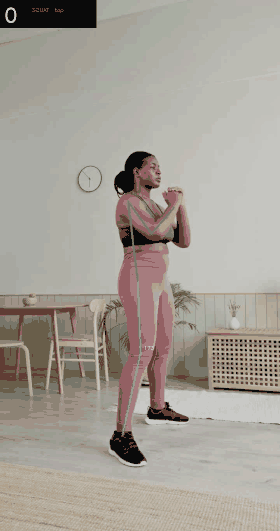

# AI Personal Trainer

**Counts repetitions and checks form from a single camera, without asking the user to stand in
the perfect spot.**

Pose estimation (MediaPipe or YOLOv8) feeds a small engine that decides when a repetition happens
and what went wrong. The engine is plain Python: no OpenCV, no model, no web framework, so it is
tested on its own and any front end can drive it.



| Exercise | Repetitions counted | Manual count | Speed (MediaPipe, laptop CPU) |
|---|---|---|---|
| Push-ups | 8 | 8 | 21 ms per frame |
| Squats | 5 | 5 | 52 ms per frame |
| Biceps curls | 6 | 6 | 46 ms per frame |
| Shoulder press | 4 | 4 | 21 ms per frame |

Four clips, 23 repetitions, all counted correctly. Speed varies with the resolution of the clip,
not with the exercise.

---

## The problem this project ended up being about

The first version used fixed angles: a repetition started when the elbow angle went above 150
degrees and ended when it dropped below 110. That works on the clip it was tuned on, and breaks
on the next one.

A fully extended arm was measured at **150, 141, 166 and 171 degrees** on four different clips.
Body proportions, distance to the camera, camera angle and the pose model itself all shift the
number. On one clip the curl never reached the fixed threshold at all: **0 repetitions counted out
of 6**.

**The engine now learns the range of movement each person actually produces**, and places the
thresholds inside it, at 30 % and 70 %. Nothing is compared against an absolute angle any more.

| Clip | Range measured | Thresholds used |
|---|---|---|
| Push-ups | 69 to 166 degrees | 98 / 137 |
| Squats | 81 to 175 degrees | 109 / 147 |
| Curls | 91 to 171 degrees | 115 / 147 |
| Shoulder press | 46 to 163 degrees | 81 / 128 |

A movement smaller than 40 degrees is never counted, so small fidgets do not become a set. The
trade-off is stated plainly: someone who only ever does half repetitions will have them counted,
because nothing in the video says what that person is capable of.

## Angles are measured in 3D

MediaPipe also returns a 3D estimate of the body in metres. Angles computed from it barely change
when the person turns away from a perfect side view, which a flat image angle cannot do.

On a synthetic skeleton with a known 60 degree bend:

| Person turned by | Measured in 3D | Measured on the flat image |
|---|---|---|
| 0 degrees (side on) | 60 | 60 |
| 60 degrees | **60** | 41 |
| 85 degrees (almost facing) | **60** | under 15 |

YOLOv8 does not provide depth, so with that detector the code falls back to the flat measurement
and says so. Anything defined in the image (the floor line, the frame edges, the front-view check)
stays in 2D by construction.

## What is checked, and how much to trust it

| Exercise | Counting | Form checks | Source |
|---|---|---|---|
| Push-up | range-based | hips dropping, hips too high | Standard test protocols (FITNESSGRAM 90-degree push-up, US Army APFT): body straight from head to heels |
| Squat | range-based | torso too far forward | Common coaching cue, **not** taken from a protocol |
| Biceps curl | range-based | upper arm moving, torso swinging | Common coaching cues |
| Shoulder press | range-based | torso leaning back | Common coaching cue |

**Counting is the part to trust today. The form thresholds are first estimates.**

Two decisions follow from measuring rather than assuming:

- **Depth is measured but not judged on push-ups.** Asked where the upper arm is at the bottom,
  YOLOv8 and MediaPipe disagreed by up to 48 degrees on the same clip. Until keypoint accuracy is
  checked against annotated frames, no advice is given about going lower. The measurement is still
  recorded in every run.
- **Hip alignment is judged**, because the two detectors agreed on it within 2 to 5 degrees on the
  same clips: 167 to 179 degrees on correct push-ups, 117 to 133 on a clip with visibly raised
  hips. The 25 degree tolerance sits between those two groups, and three clips are not enough to
  fix it for good.



Rules are written as *movement*, not position: a curl on an inclined bench keeps the upper arm
forward and the torso tilted for the whole set, which is correct. The fault is the upper arm or
the torso *moving* during the repetition.

## Adding an exercise

An exercise is one `ExerciseSpec`: the joints whose angle drives the repetition, a fallback
threshold pair, and its rules. No new code paths.

```python
SQUAT = ExerciseSpec(
    name="squat",
    primary=("hip", "knee", "ankle"),
    down_below=120, up_above=160,          # only used until the person's range is known
    depth_target=100, depth_message="Go a bit lower. Try to bring your thighs level with the floor.",
    rules=(FormRule("torso_too_forward", "Keep your chest up.", torso_lean,
                    lambda v: v > 55, ("shoulder", "hip")),),
)
```

## Feedback the user can read

Raw checks flicker: a fault seen on five frames lasts 0.2 seconds and cannot be read. A fault is
announced only after it persists, stays on screen long enough to read, and is not repeated for
six seconds. Between repeats the coach simply counts: *"That's 3."*



## Run it

```bash
python -m venv .venv && .venv\Scripts\activate      # Windows; source .venv/bin/activate elsewhere
pip install -r requirements.txt
curl -L -o pose_landmarker_full.task https://storage.googleapis.com/mediapipe-models/pose_landmarker/pose_landmarker_full/float16/latest/pose_landmarker_full.task
```

```bash
python src/run_video.py --exercise pushup --source clip.mp4       # a video file
python src/run_video.py --exercise squat --source 0               # a webcam
python src/run_video.py --exercise biceps_curl --source clip.mp4 --detector yolo --imgsz 320
streamlit run src/app.py                                          # browser interface
python src/check_camera.py                                        # find a working camera index
python -m pytest -q                                               # 52 tests
```

Each run writes an annotated video, a per-frame CSV (angles, phase, measurements, keypoints) and
a JSON summary to `runs/`.

## Limits

- **Real time works from the command line**, where a frame costs about 21 ms with MediaPipe,
  against 33 ms available at 30 fps. The Streamlit page sends every frame to the browser over
  HTTP and lags; it is meant for analysing a file. A real-time web version needs WebRTC.
- **Side view is the reference.** A front view is detected and reported, because angles measured
  from the front are distorted; they are not silently used as if they were fine.
- **Keypoints outside the frame are counted and reported.** MediaPipe extrapolates a hand raised
  above the top edge and still marks it visible; the number of affected frames is in every summary.
- **One person at a time** by default. `--poses 3` keeps the person closest to the camera when
  others are in shot, at roughly five times the cost per frame.
- **Depth comes from a single camera**, so it is an estimate, not a measurement.
- Validated on four clips and 23 repetitions. That is enough to show the counting works and not
  enough to certify the form thresholds.

## Structure

```
.
├── src/
│   ├── coach/              # the engine: no OpenCV, no model, no web framework
│   │   ├── engine.py       # repetitions, phases, adaptive thresholds
│   │   ├── exercises.py    # one spec per exercise, plus the measurements
│   │   ├── feedback.py     # when to say something, and when to keep quiet
│   │   ├── geometry.py     # angles, floor line, COCO keypoint layout
│   │   └── pose.py         # one body side, 3D when available
│   ├── detectors.py        # MediaPipe and YOLOv8 behind the same interface
│   ├── run_video.py        # file or webcam, writes the run to runs/
│   ├── app.py              # Streamlit front end
│   ├── draw.py             # overlay
│   ├── make_gif.py         # annotated video -> small GIF for this README
│   └── check_camera.py     # camera troubleshooting
├── tests/                  # 52 tests on synthetic skeletons with known angles
├── assets/
└── requirements.txt
```

Tests build skeletons whose angles are known exactly, so the engine is checked without a model or
a video: counting, half repetitions, jitter around a threshold, lost tracking, a person appearing
mid-movement, knee push-ups, inclined-bench curls, and the 3D versus flat comparison above.

## Next

Elbow flare, knee tracking and other faults need a second camera or a front view. Calibrating the
form thresholds needs clips with per-repetition labels. A real-time browser version needs WebRTC.

## Credits

Test clips from [Pexels](https://www.pexels.com), free to use:

- [Man working out at the gym](https://www.pexels.com/video/man-working-out-at-the-gym-4945123/) by Anastasia Shuraeva
- [Man doing a push-up at the gym](https://www.pexels.com/video/man-doing-a-push-up-at-the-gym-4742664/) by Ketut Subiyanto
- [A woman in activewear doing squats at home](https://www.pexels.com/video/a-woman-in-activewear-doing-squats-at-home-8837221/) by MART PRODUCTION
- [Homme sport puissance fitness](https://www.pexels.com/fr-fr/video/homme-sport-puissance-fitness-5319089/) by Tima Miroshnichenko
- [Homme assis faisant du sport](https://www.pexels.com/fr-fr/video/homme-etre-assis-faire-du-sport-formation-4367541/) by Pavel Danilyuk

---

**Aymane Snoussi**
[LinkedIn](https://www.linkedin.com/in/aymane-snoussi-538561335/) · [GitHub](https://github.com/AYMANE-SNOUSSI)