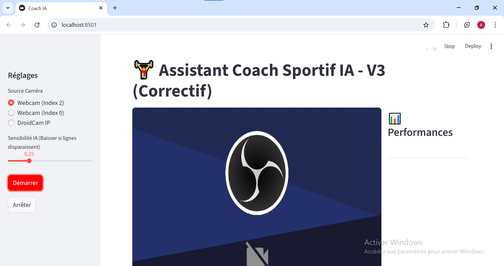

# 🏋️‍♂️ AI Personal Trainer - Coach Sportif Intelligent


> **Transformez votre webcam en coach sportif personnel capable de corriger votre posture et de compter vos répétitions en temps réel.**

---

## 🎥 Démonstration

### L'Algorithme en action (Analyse géométrique)


### L'Interface Utilisateur (Application Streamlit)


---

## 📖 À propos du Projet

Ce projet est une application de **Vision par Ordinateur (Computer Vision)** conçue pour assister les sportifs à domicile. Contrairement aux applications classiques basées sur des capteurs physiques, ce système utilise uniquement le flux vidéo d'une caméra pour analyser la biomécanique du mouvement.

**Objectifs :**
1.  **Prévention des blessures :** Analyse l'angle du dos en temps réel pour détecter les cambrures dangereuses.
2.  **Comptage automatique :** Valide une répétition uniquement si l'amplitude est complète (Bras tendus $\rightarrow$ Bras pliés $\rightarrow$ Bras tendus).

> **Note :** La version actuelle est optimisée pour les **Pompes (Push-ups)**, avec une détection hybride (sur les pieds ou sur les genoux).

---

## 📂 Structure du Code & Explications

Voici comment le projet est architecturé. Chaque fichier a un rôle précis :

```text
C:.
├───assets/                 # Images et GIFs pour le README
├───data/                   # Vidéos de test (pour le développement)
├───models/                 # Le modèle IA (yolov8n-pose.pt)
├───src/                    # Code Source
│   ├───app.py              # 🚀 L'APPLICATION FINALE
│   ├───test_video_counter.py # 🛠️ OUTIL DE TEST & GÉNÉRATEUR GIF
│   └───main.py             # 🧪 SCRIPT DE DEBUG
└───requirements.txt        # Liste des dépendances